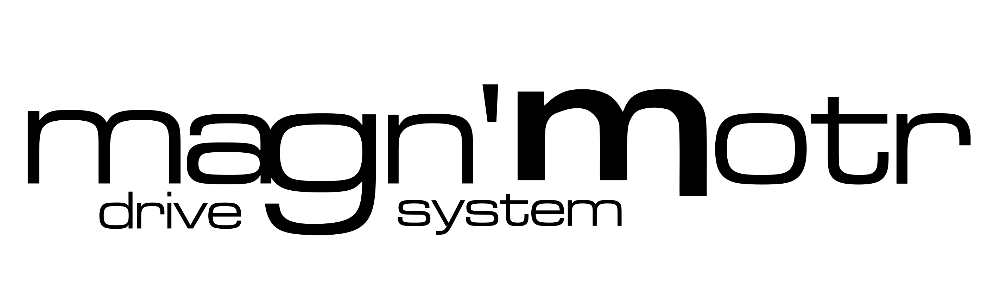

# magn'Motr 3D Engine

<p align="center">
  
</p>

[](https://github.com/coetz3r/magn_Motr)

A lightweight, zero-build interactive 3D WebGL model viewer and mechanical explainer template powered by Three.js ES Modules.

**Repository:** https://github.com/coetz3r/magn_Motr

---

## Overview

**magn'Motr** is a plug-and-play starter kit designed for web developers, engineers, CAD designers, and educators who need to embed interactive 3D models into a web page. 

It eliminates the overhead of complex front-end build pipelines (such as Vite, Webpack, or React) by using native browser ES Import Maps. Simply drop in your exported `.glb` or `.gltf` 3D model, configure your mesh transparency rules, and serve.

---

## Features

- **Plug-and-Play Mesh Loading**: Automatically centers and scales any `.glb` or `.gltf` 3D model within the camera viewport.
- **Automated Shell Transparency**: Scans component names and dynamically applies semi-transparent physical materials to outer casings or frames.
- **Customizable Kinematics Engine**: Built-in math routines linking rotational motion to linear translation (e.g., swashplate to axial piston displacement).
- **Minimalist Blue Progress Indicator**: Lightweight, zero-dependency loading bar with visual glow feedback.
- **Zero-Build Architecture**: Runs natively in all modern web browsers using ES Modules.
- **Responsive WebGL Canvas**: Auto-resizes smoothly across screen resolutions.

---

## Interactive Controls

| Input / Gesture | Action |
| :--- | :--- |
| **Left Click + Drag** | Orbit / rotate camera around the model center |
| **Right Click + Drag** | Pan camera position across the viewport plane |
| **Ctrl + Right Click + Drag** | Fine-tuned vertical and lateral camera adjustment |
| **Scroll Wheel** | Zoom camera in / out relative to focal target |

---

## Technologies

- HTML5 & CSS3
- JavaScript (ES6+ Modules)
- Three.js (r160+ via ES Import Maps)
- WebGL
- Git / GitHub

---

## Customization & Tweaking Guide

All configuration options live inside `js/magn_Motr.js`.

### 1. Swapping the 3D Model File
Place your exported `.glb` file into `assets/` and update the file path in `js/magn_Motr.js`:

```javascript
const modelPath = (typeof magnaData !== "undefined" && magnaData.modelUrl)
  ? magnaData.modelUrl
  : "assets/your_model.glb";
```

### 2. Auto-Transparency Keywords & Opacity
Set keywords to match your CAD or Blender mesh names so the engine knows which outer housings to make transparent:

```javascript
const outerHousingTerms = ["frame", "block", "carrier", "output", "housing", "casing", "cover"];

// Modify opacity inside loader loop (0.0 = fully clear, 1.0 = solid)
mat.transparent = true;
mat.opacity = 0.35;
```

### 3. Camera Perspective (FOV)
Adjust wide-angle depth distortion versus a flatter, CAD-style isometric view in Section 1:

```javascript
// Lower value (e.g. 35 - 45) = Flatter CAD look
// Higher value (e.g. 65 - 75) = Stronger depth perspective
const camera = new THREE.PerspectiveCamera(55, width / height, 0.1, 1000);
```

### 4. Customizing Progress Bar Colors
Tweak the loading bar color scheme to match your branding:

```javascript
progressBarFill.style.background = "#0088ff";           // Main color
progressBarFill.style.boxShadow  = "0 0 8px #0088ff";   // Glow radius & color
```

---

## Local Development

Due to modern browser security policies (CORS) regarding ES Modules (`type="module"`) and external 3D file requests, opening `index.html` directly via `file:///...` will cause cross-origin errors. **The project must be served over a local HTTP server.**

### Option A: VSCodium / VS Code Live Server
1. Install the **Live Server** extension in VSCodium.
2. Right-click `index.html` in the file explorer and select **Open with Live Server**.
3. Firefox/Chrome will open `http://127.0.0.1:5500/index.html`.

### Option B: Terminal via Python HTTP Server
Open your terminal in the project directory and run:

```bash
python3 -m http.server 8000
```

Then visit `http://localhost:8000` in your web browser.

---

## Repository Structure

```text
assets/
├── magn_Motr.glb       # Default 3D model asset
├── magn_Motr.png       # Header logo
└── screenshot.png      # Viewport showcase screenshot

css/
└── style.css           # Viewport & canvas layout styles

js/
└── magn_Motr.js        # Core engine, OrbitControls, & loader logic

index.html              # HTML mount point & ES import map
LICENSE                 # Open source license text
README.md               # Documentation
```

---

## Design Goals

- Fast asset loading and zero build complexity
- Clean, maintainable vanilla JavaScript architecture
- Modular structure for easy integration into existing sites or CMS platforms
- Responsive full-screen WebGL presentation

---

## License

Copyright © 2026 Pieter Coetzer

Distributed under the **MIT License**. Free for personal, academic, and commercial usage. See `LICENSE` for details.